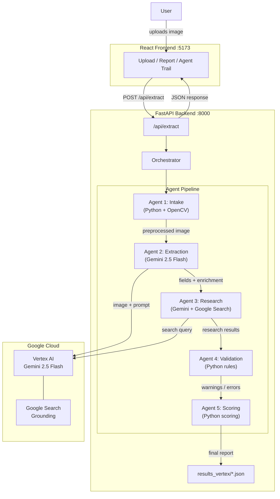
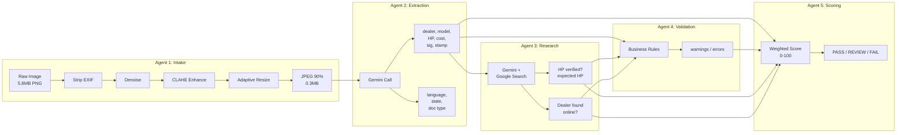

# Architecture Document

## Overview

Invoice Intelligence is a multi-agent system that verifies tractor invoices for loan processing. It replaces manual document review with an autonomous 5-agent pipeline that extracts fields, cross-references data against the open web, and produces an authenticity score -- all without human intervention.

## System Architecture



### Data Flow



## Agent Roles

### Agent 1: Intake Agent

**Type:** Pure Python (OpenCV + Pillow, no AI calls)

**Role:** Validates and preprocesses the uploaded image before any AI processing.

**Steps:**
1. Validate file format (PNG, JPG, JPEG, WebP) and size (< 10MB)
2. Strip EXIF metadata (removes GPS, camera data, embedded thumbnails)
3. Apply denoising (`cv2.fastNlMeansDenoising`) to clean phone camera noise
4. Apply CLAHE contrast enhancement to improve text readability
5. Adaptive resize -- cap longest edge at 1600px, preserving aspect ratio
6. Convert to JPEG 90% quality

**Output:** Preprocessed image bytes (e.g., 5.8MB PNG becomes 0.3MB JPEG -- 95% smaller)

**Error handling:** Rejects unsupported formats and unreadable files immediately, halting the pipeline.

### Agent 2: Extraction Agent

**Type:** 1 Gemini 2.5 Flash API call via Vertex AI

**Role:** Extracts all structured fields from the invoice image in a single multimodal call.

**Fields extracted:**
- `dealer_name` -- the tractor dealer/seller company
- `model_name` -- tractor model and number
- `horse_power` -- engine HP rating
- `asset_cost` -- total invoice amount in INR
- `signature` -- presence and bounding box (% coordinates)
- `stamp` -- presence and bounding box (% coordinates)
- `language_detected` -- primary document language
- `state_detected` -- Indian state from address/pincode
- `document_type` -- invoice, quotation, proforma, or receipt

**Error handling:** If Gemini returns malformed JSON, the agent retries once with the same prompt (self-correction). If both attempts fail, the pipeline stops.

### Agent 3: Research Agent

**Type:** 1 Gemini API call with Google Search grounding

**Role:** Verifies extracted data against the open web. This is the key differentiator for the agentic approach.

**Verifications performed:**
1. **Model HP verification** -- searches "What is the HP of [model] tractor?" and compares against the invoice HP
2. **Dealer verification** -- searches whether the dealer is a real, registered business with online presence

**Output:**
- `model_hp_verified` (bool) and `expected_hp` from manufacturer specs
- `dealer_found_online` (bool) and `dealer_search_summary`

**Error handling:** If Google Search is unavailable or returns no results, the agent returns a "warn" status and the pipeline continues with partial data.

### Agent 4: Validation Agent

**Type:** Pure Python (no AI calls)

**Role:** Cross-checks all extracted and researched data against business rules.

**Checks performed:**
- HP from invoice vs HP from web search -- do they match (within +/- 5)?
- Are all required fields populated?
- Is HP in the valid tractor range (15-200)?
- Are both signature and stamp present?
- Is the dealer found online?

**Output:** Lists of `warnings` and `errors`, `hp_match` flag, `all_fields_present` flag.

### Agent 5: Scoring Agent

**Type:** Pure Python (no AI calls)

**Role:** Computes a weighted authenticity score and compliance verdict.

**Scoring breakdown (0-100 points):**

| Component | Max Points | How scored |
|-----------|-----------|------------|
| Field completeness | 20 | (filled fields / 6) x 20 |
| HP verification | 20 | 20 if verified, 10 if web HP found but mismatched, 0 if unknown |
| Dealer verification | 20 | 20 if found online, 0 if not |
| Signature present | 15 | 15 if detected, 0 if not |
| Stamp present | 15 | 15 if detected, 0 if not |
| Document quality | 10 | 10 if no issues, 5 if minor warnings, 0 if errors |

**Compliance status:**
- **PASS** (score >= 70): Invoice verified, proceed with loan
- **REVIEW** (score 40-69): Manual review recommended
- **FAIL** (score < 40): Invoice rejected

**Output:** Authenticity score, compliance status, score breakdown, and a natural language summary.

## Communication Pattern

Agents communicate through a shared context object (Python dict) passed by the orchestrator. Each agent reads what it needs from previous agents' output and appends its own results. There are no direct agent-to-agent calls.

```
Orchestrator
  │
  ├── runs IntakeAgent(image_bytes) → processed_bytes
  ├── runs ExtractionAgent(processed_bytes) → fields, enrichment
  ├── runs ResearchAgent(fields, enrichment) → research
  ├── runs ValidationAgent(fields, enrichment, research) → validation
  └── runs ScoringAgent(fields, enrichment, research, validation) → scoring
```

## Audit Trail

Every agent execution is logged in the `agent_trail` array:

```json
{
  "agent": "research",
  "status": "pass",
  "time_sec": 5.86,
  "decision": "HP verified (35), dealer found online"
}
```

This provides full auditability of every decision the system makes, which is critical for financial services compliance.

## Technology Stack

| Component | Technology |
|-----------|-----------|
| AI model | Gemini 2.5 Flash on Vertex AI |
| Web search | Google Search grounding (built into Gemini) |
| Backend | Python, FastAPI, OpenCV, Pillow |
| Frontend | React, Vite |
| Auth | GCP Service Account (OAuth2) |
| Image preprocessing | OpenCV (denoise, CLAHE, resize) |
